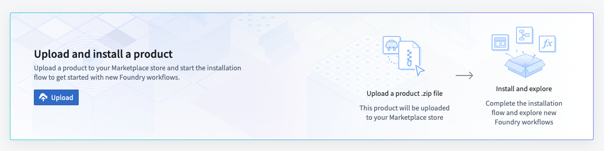
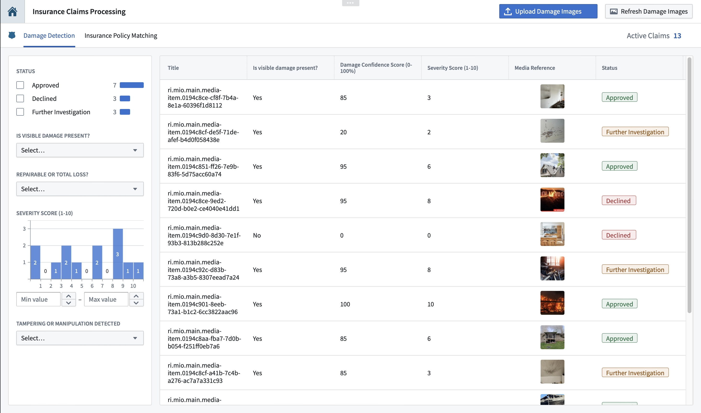
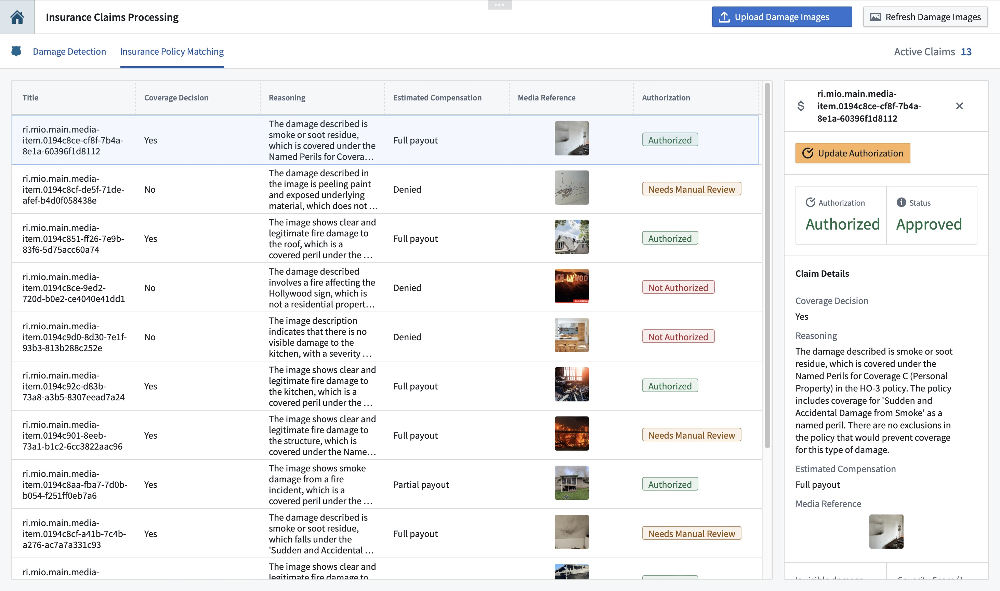

# AIP Insurance Claims Processing

This Foundry application streamlines **insurance claims processing** by leveraging **AIP logic** to detect fraud and validate coverage. Watch [this video](https://youtu.be/2uGwu4hJiYw?si=cih3Pur0X7nGfj72) to understand the workflow!

The system:

- **Flags invalid claims** by analyzing uploaded images for fraud indicators using **LLM detection** (AI-generated, photoshopped, or irrelevant images).
- **Matches damage against policy terms** to determine eligibility for compensation, with an **AI-generated reasoning engine**.
- **Automates ingestion and processing** via **Pipeline Builder, Ontology Actions, and Automate**, ensuring seamless integration with existing workflows.
- **Empowers insurance adjusters** with an intuitive **Workshop interface** to review AI recommendations, override decisions, and approve or decline claims.

This was built in just over a week, showcasing how **Foundry + AIP** can **reduce fraud, accelerate processing, and improve claims accuracy**.

## Upload Package to Your Enrollment

The first step is uploading your package to the Foundry Marketplace:

1. Download the project's `.zip` file from this repository
2. Access your enrollment's marketplace at:
   ```
   {enrollment-url}/workspace/marketplace
   ```
3. In the marketplace interface, initiate the upload process:
   - Select or create a store in your preferred project folder
   - Click the "Upload to Store" button
   - Select your downloaded `.zip` file



## Install the Package

After upload, you'll need to install the package in your environment. For detailed instructions, see the [official Palantir documentation](https://www.palantir.com/docs/foundry/marketplace/install-product).

The installation process has four main stages:

1. **General Setup**
   - Configure package name
   - Select installation location

2. **Input Configuration**
   - Configure any required inputs. If no inputs are needed, proceed to next step
   - Check project documentation for specific input requirements

3. **Content Review**
   - Review resources to be installed such as Developer Console, the Ontology, and Functions

4. **Validation**
   - System checks for any configuration errors
   - Resolve any flagged issues
   - Initiate installation
  
## Manual Setup

5. Open the **Workshop interface** file

6. Click the **Upload Images** in the top right corner and choose any damage photos from local computer

7. The image will be then added to the **Images mediaset**, this automatically triggers a **pipeline** that extracts metadata and **updates the Ontology**. As soon as the object is added, an **AIP function analyzes the image** for key details (damage type, severity, potential fraud). The second AIP function then **matches these findings with the insurance policy** to determine eligibility. The results are sent back to Workshop, **fully automating the claims validation process** 

8. You can **override AI decisions** and manually approve/deny claims

The package also includes sample insurance policy and damaged images uploaded - it's best to user your own examples to try out the app!

## Screenshots & Demo

**Watch the Demo:**  
[🔗 Click here to view the demo](https://youtu.be/2uGwu4hJiYw?si=cih3Pur0X7nGfj72)

### **Claims Log Dashboard Overview**


### **Coverage Decisions & Overriding Overview**


